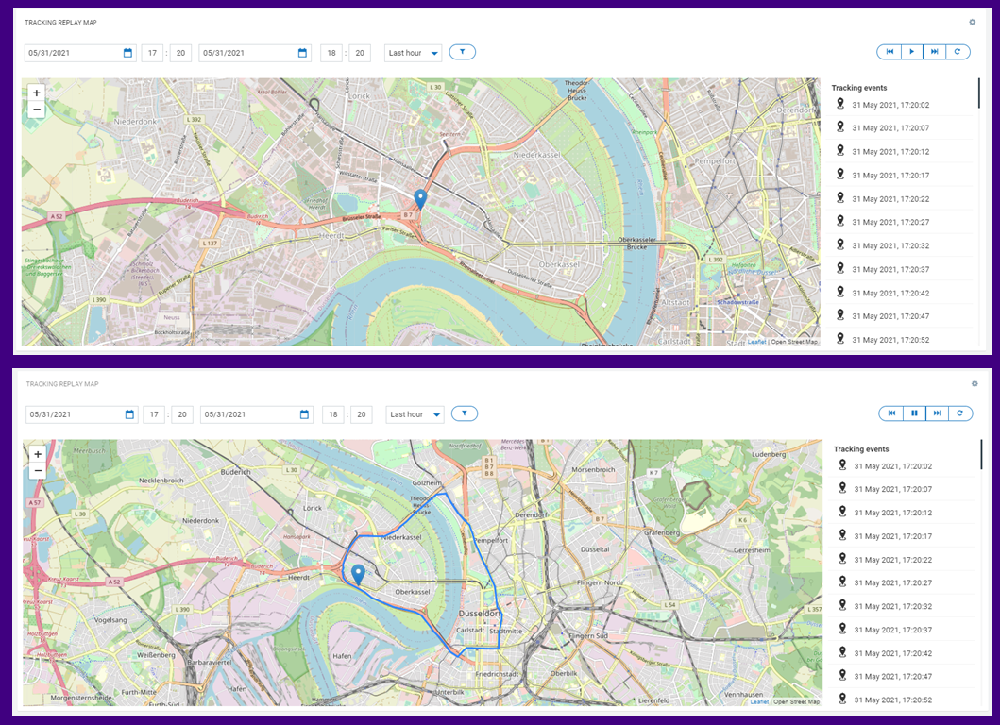

# Cumulocity Tracking Replay Map Widget Plugin 

The Cumulocity Tracking Replay widget is the Cumulocity module federation plugin created using c8ycli. This plugin can be used in Application Builder or Cockpit. The Cumulocity Tracking Replay widget helps you to display track lines of the tracking device with replay feature on map.

### Please choose Tracking Replay Map Widget release based on Cumulocity/Application builder version:

|APPLICATION BUILDER &nbsp;| &nbsp;CUMULOCITY&nbsp; | &nbsp;TRACKING REPLAY MAP WIDGET PLUGIN&nbsp;  |
|--------------------|------------|------------------------------------|
| 2.x.x(coming soon) | >= 1016.x.x| 1.x.x                              |

## Features
*  **Tracking Events:** Displays the position in map at a particular time.

*  **Faster/ Slower:** Configurable speed for tracing the path movement.

*  **Date/Time Filter:** Filters tracking events based on the date/time selected.

*  **Marker Click:** Shows the longitude and latitude of the marker.

*  **Configurable Zoom:**  Select and configurable zoom which is best fit for your map.  

*  **Configurable Device:** Based on configuration during widget configuration a device can be selected. 

*  **Configurable Event And Fragment Type:** Based on configuration during widget configuration, events can be filtered to get only the desired type of event.

## Prerequisite
   Cumulocity c8ycli >=1016.x.x
   
## Installation

### Runtime Widget Deployment?

* This widget support runtime deployment. Download [Runtime Binary](https://github.com/SoftwareAG/cumulocity-tracking-replay-map-widget-plugin/releases/download/1.0.0/sag-ps-pkg-tracking-replay-1.0.0.zip) and install via Administrations --> Ecosystems --> Applications --> Packages 

## QuickStart
  
This guide will teach you how to add widget in your existing or new dashboard.

1. Open you application from App Switcher
  
2. Add new dashboard or navigate to existing dashboard
  
3. Click `Add Widget`

4. Search for `Tracking Replay Map`

5. Select `Target Assets or Devices`

6. Click `Save`

Congratulations! Tracking Replay Map is configured.

## User Guide

*  **Target assets or devices:** User can select a device. Based on device, list of devices will be display on Map. Only those devices are visible on map where position attributes are configured.

**Tracking Replay Map On Screen Options:**
 
* **Filters**:  The following filters can be used to filter/get data for the specified time period:
	*  **Start Date/Time**
	*  **End Date/Time**
	*  **Last minute**
	*  **Last hour**
	*  **Last day**
	*  **Last week**
	*  **Last month**

  *  **Slower**: Reduces the marker speed to half.
  *  **Play/ Pause**: Marker traces the path when played and can be paused at any instance.
  *  **Faster**: Increase the marker speed to double.
  *  **Reload**: Useful for force reload/refresh map.
  *  **Zoom in/ out** : Zooms in/out of the map.

  **Tracking Replay Map On Widget Configuration:**

	*	**Event Type**: Provide Event type (eg:c8y_LocationUpdate)
	*	**Fragment Type**: Provide fragment name(e.g. c8y_Position) which should have lat and lng

------------------------------------------

This widget is provided as-is and without warranty or support. They do not constitute part of the Software AG product suite. Users are free to use, fork and modify them, subject to the license agreement. While Software AG welcomes contributions, we cannot guarantee to include every contribution in the master project.
_____________________
For more information you can Ask a Question in the [TECH Community Forums](https://tech.forums.softwareag.com/tag/Cumulocity-IoT).
